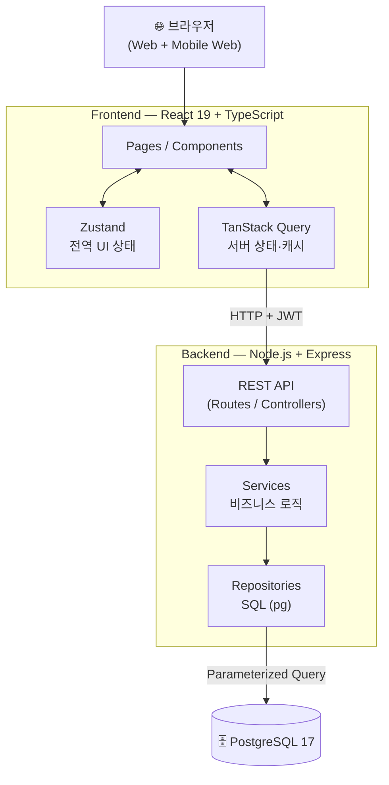
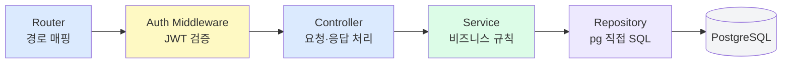
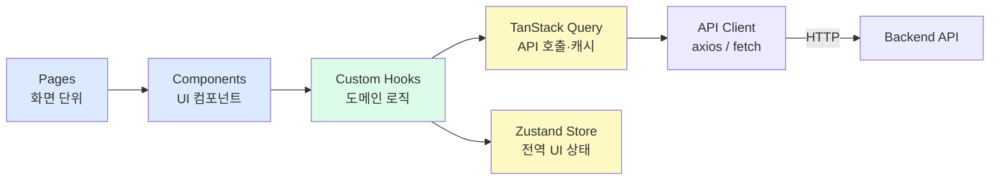
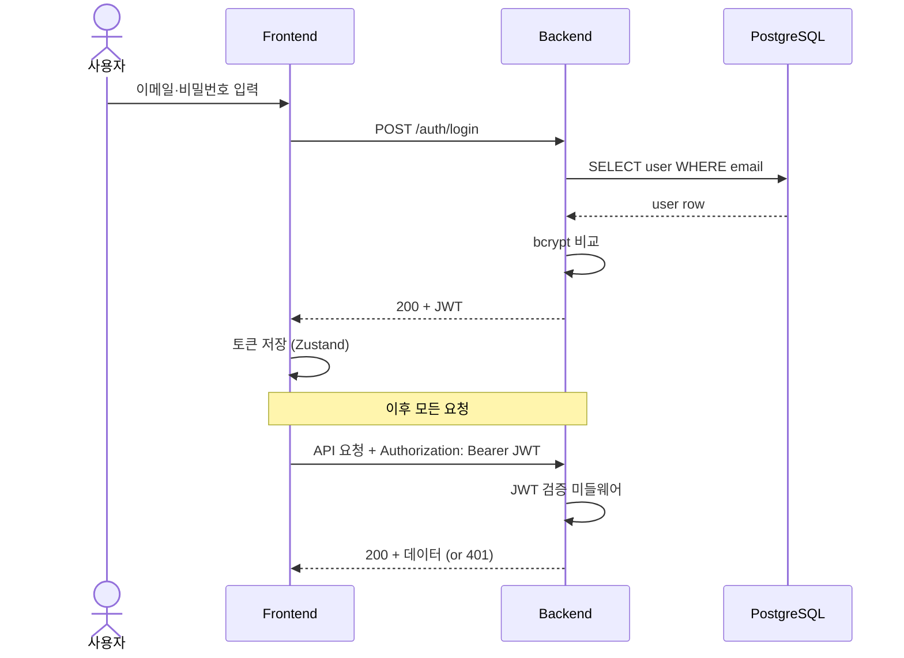
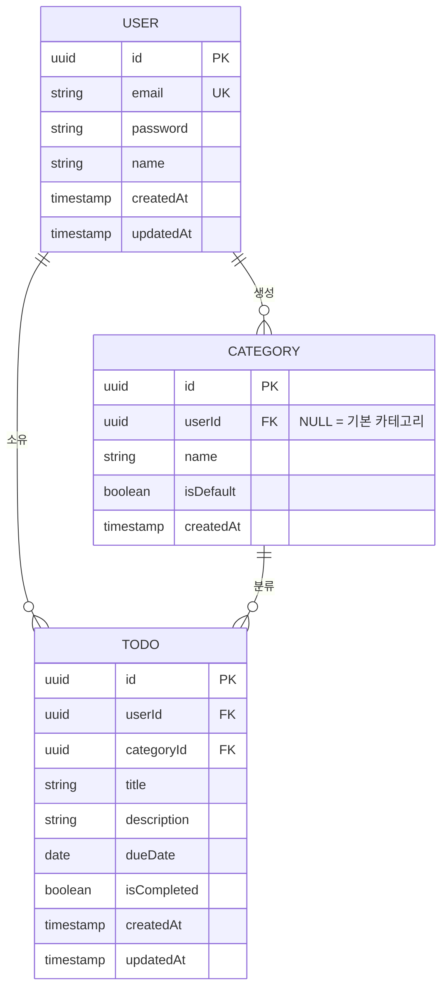
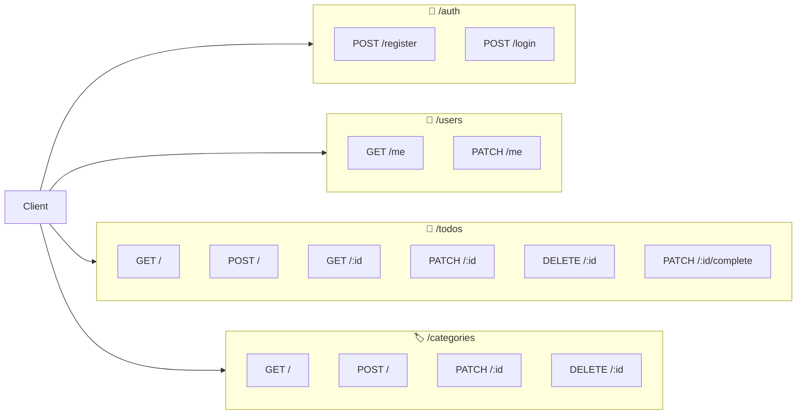

# 기술 아키텍처 다이어그램

**프로젝트명:** TodoListApp
**버전:** 1.0.0
**작성일:** 2026-05-13
**참조 문서:** `docs/2-prd.md`, `docs/4-project-structure.md`

---

## 1. 전체 시스템 구조

---

## 2. 백엔드 레이어 구조

> 의존 방향: Router → Middleware → Controller → Service → Repository → DB (단방향, 역방향 금지)

---

## 3. 프론트엔드 레이어 구조

---

## 4. 인증 흐름

---

## 5. DB 엔티티 관계

---

## 6. 도메인별 API 엔드포인트 구조

