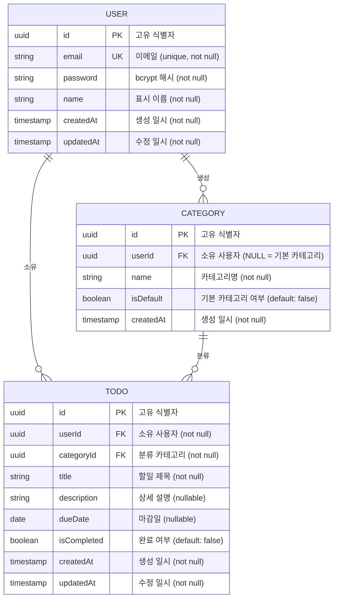

# ERD (Entity-Relationship Diagram)

**프로젝트명:** TodoListApp
**버전:** 1.0.0
**작성일:** 2026-05-13
**참조 문서:** `docs/2-prd.md`, `docs/1-domain-definition.md`

---

## 1. ERD 다이어그램

---

## 2. 엔티티 상세 정의

### 2.1 USER

| 컬럼 | 타입 | 제약 | 설명 |
|------|------|------|------|
| id | UUID | PK, NOT NULL | 고유 식별자 (auto-generate) |
| email | VARCHAR | UK, NOT NULL | 로그인 이메일 |
| password | VARCHAR | NOT NULL | bcrypt 해시 (salt ≥ 10) |
| name | VARCHAR | NOT NULL | 표시 이름 |
| createdAt | TIMESTAMP | NOT NULL | 가입 일시 |
| updatedAt | TIMESTAMP | NOT NULL | 정보 수정 일시 |

### 2.2 CATEGORY

| 컬럼 | 타입 | 제약 | 설명 |
|------|------|------|------|
| id | UUID | PK, NOT NULL | 고유 식별자 |
| userId | UUID | FK → USER.id, **NULL 허용** | 소유 사용자 (NULL이면 기본 카테고리) |
| name | VARCHAR | NOT NULL | 카테고리명 |
| isDefault | BOOLEAN | NOT NULL, DEFAULT false | 기본 카테고리 여부 |
| createdAt | TIMESTAMP | NOT NULL | 생성 일시 |

> **기본 카테고리 규칙:** `isDefault = true`인 카테고리는 `userId = NULL`을 가집니다.
> 회원가입 성공 시 일반·업무·개인 3개의 기본 카테고리가 자동 생성됩니다 (UC-A-01 extend UC-C-01).

### 2.3 TODO

| 컬럼 | 타입 | 제약 | 설명 |
|------|------|------|------|
| id | UUID | PK, NOT NULL | 고유 식별자 |
| userId | UUID | FK → USER.id, NOT NULL | 소유 사용자 |
| categoryId | UUID | FK → CATEGORY.id, NOT NULL | 분류 카테고리 |
| title | VARCHAR | NOT NULL | 할일 제목 |
| description | TEXT | NULL 허용 | 상세 설명 |
| dueDate | DATE | NULL 허용 | 마감일 |
| isCompleted | BOOLEAN | NOT NULL, DEFAULT false | 완료 여부 |
| createdAt | TIMESTAMP | NOT NULL | 생성 일시 |
| updatedAt | TIMESTAMP | NOT NULL | 수정 일시 |

---

## 3. 관계 정의

| 관계 | 카디널리티 | 설명 |
|------|-----------|------|
| USER → TODO | 1 : N | 사용자는 여러 할일을 소유한다. 사용자 탈퇴 시 할일 데이터 삭제 |
| USER → CATEGORY | 1 : N | 사용자는 여러 카테고리를 생성한다. 단, 기본 카테고리(userId=NULL)는 예외 |
| CATEGORY → TODO | 1 : N | 카테고리는 여러 할일을 분류한다 |

---

## 4. 관련 비즈니스 규칙

| 규칙 ID | 내용 |
|---------|------|
| BR-U-01 | 이메일은 전체 시스템에서 고유해야 한다 |
| BR-U-02 | 비밀번호는 bcrypt(salt ≥ 10)로 해시 저장한다 |
| BR-U-04 | 사용자 탈퇴 시 해당 사용자의 모든 데이터(할일, 카테고리)를 삭제한다 |
| BR-T-01 | 할일은 반드시 하나의 카테고리에 속해야 한다 |
| BR-T-04 | 완료된 할일은 다시 미완료로 되돌릴 수 없다 |
| BR-C-01 | 기본 카테고리(일반·업무·개인)는 수정·삭제할 수 없다 |
| BR-C-02 | 카테고리를 삭제하면 해당 카테고리의 할일은 기본 카테고리로 이동한다 |
| BR-C-03 | 회원가입 시 기본 카테고리 3개(일반·업무·개인)가 자동 생성된다 |
