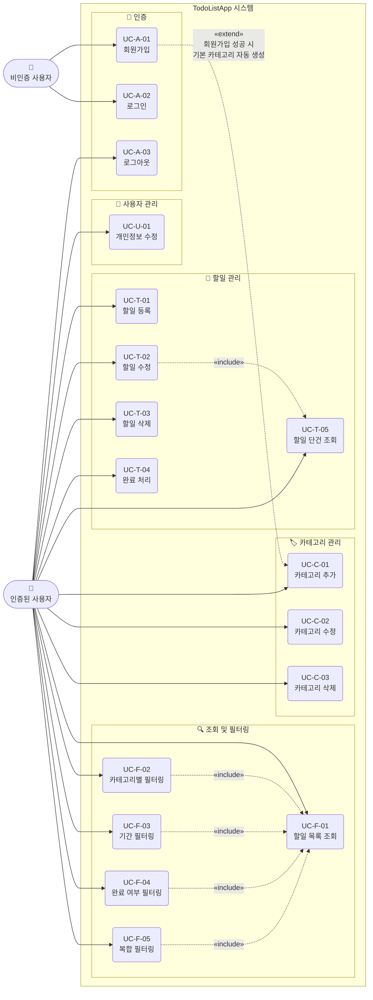

# USE CASE Diagram

**프로젝트명:** TodoListApp
**버전:** 1.0.0
**작성일:** 2026-05-13
**참조 문서:** `docs/1-domain-definition.md`, `docs/2-prd.md`

---

## 액터 정의

| 액터 | 설명 |
|------|------|
| 비인증 사용자 | 회원가입 또는 로그인 전 상태의 사용자 |
| 인증된 사용자 | 로그인하여 JWT를 보유한 상태의 사용자 |

---

## 유스케이스 다이어그램

---

## 유스케이스 목록

### 비인증 사용자

| ID | 유스케이스 | 화면 |
|----|-----------|------|
| UC-A-01 | 회원가입 | SCR-01 |
| UC-A-02 | 로그인 | SCR-02 |

### 인증된 사용자

| ID | 유스케이스 | 화면 |
|----|-----------|------|
| UC-A-03 | 로그아웃 | SCR-03 |
| UC-U-01 | 개인정보 수정 | SCR-06 |
| UC-T-01 | 할일 등록 | SCR-04 |
| UC-T-02 | 할일 수정 | SCR-04 |
| UC-T-03 | 할일 삭제 | SCR-03 |
| UC-T-04 | 완료 처리 | SCR-03 |
| UC-T-05 | 할일 단건 조회 | SCR-04 (수정 모드 진입 시 선행) |
| UC-C-01 | 카테고리 추가 | SCR-05 |
| UC-C-02 | 카테고리 수정 | SCR-05 |
| UC-C-03 | 카테고리 삭제 | SCR-05 |
| UC-F-01 | 할일 목록 조회 | SCR-03 |
| UC-F-02 | 카테고리별 필터링 | SCR-03 |
| UC-F-03 | 기간 필터링 | SCR-03 |
| UC-F-04 | 완료 여부 필터링 | SCR-03 |
| UC-F-05 | 복합 필터링 | SCR-03 |

---

## 관계 설명

| 관계 유형 | From | To | 설명 |
|-----------|------|-----|------|
| «include» | UC-T-02 할일 수정 | UC-T-05 할일 단건 조회 | 수정 화면 진입 시 반드시 단건 조회 선행 |
| «include» | UC-F-02 카테고리별 필터링 | UC-F-01 할일 목록 조회 | 필터링은 목록 조회를 포함 |
| «include» | UC-F-03 기간 필터링 | UC-F-01 할일 목록 조회 | 필터링은 목록 조회를 포함 |
| «include» | UC-F-04 완료 여부 필터링 | UC-F-01 할일 목록 조회 | 필터링은 목록 조회를 포함 |
| «include» | UC-F-05 복합 필터링 | UC-F-01 할일 목록 조회 | 복합 필터링은 목록 조회를 포함 |
| «extend» | UC-A-01 회원가입 | UC-C-01 카테고리 추가 | 회원가입 성공 시 기본 카테고리(일반·업무·개인) 자동 생성 |
